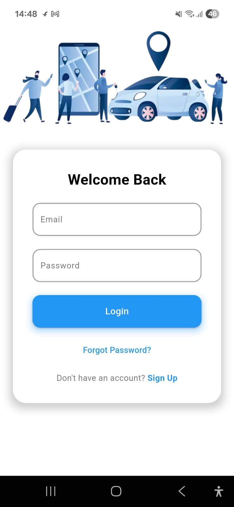
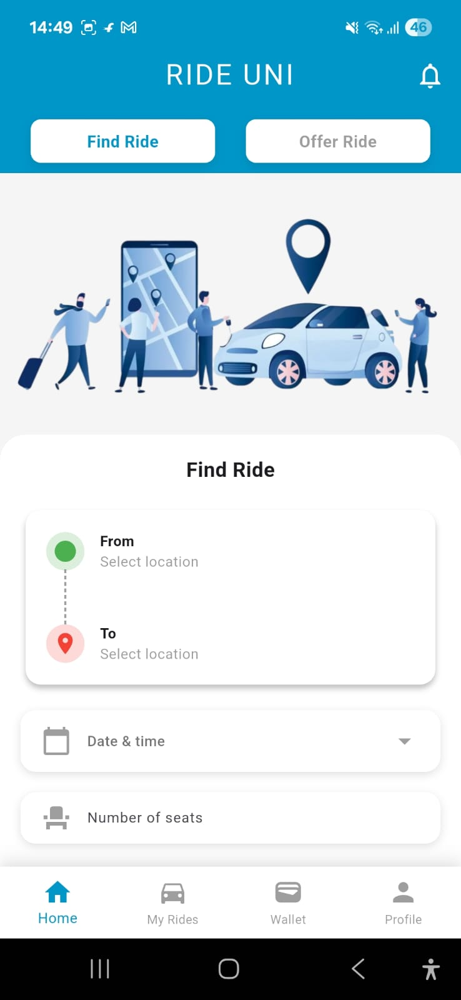
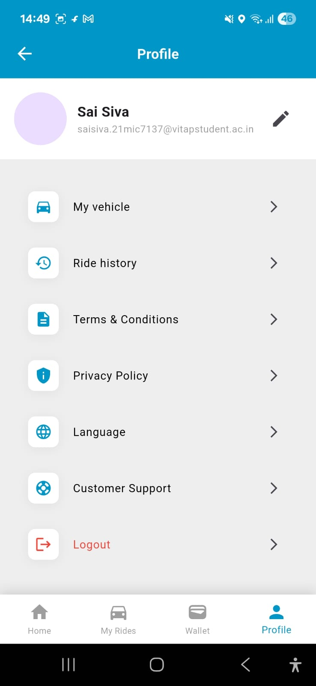
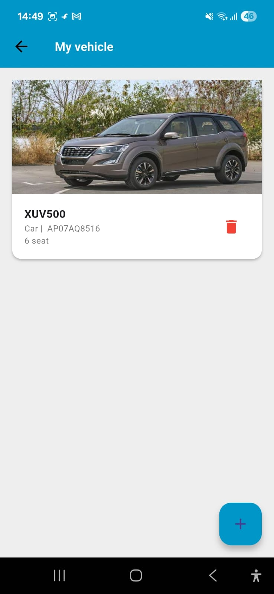
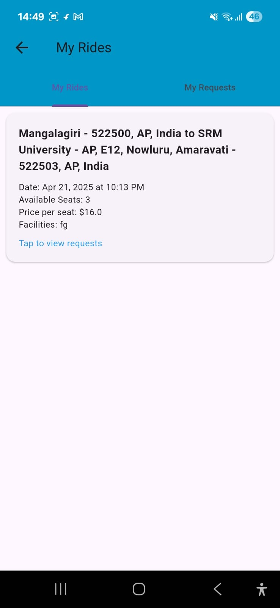
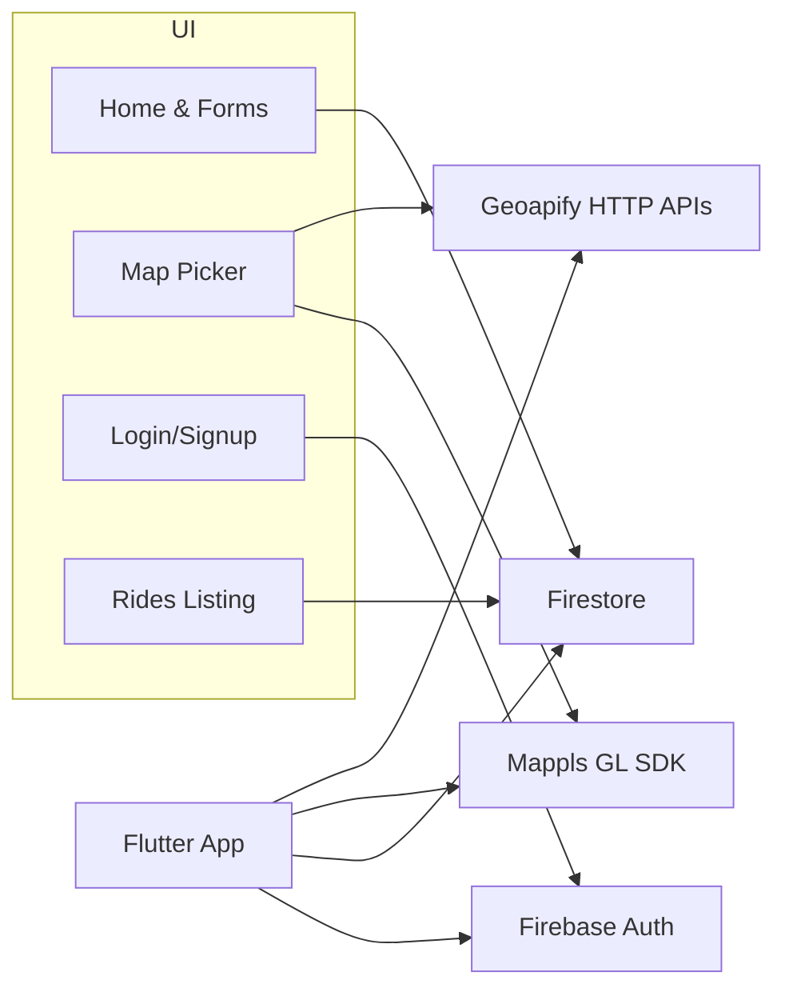

# RideUni-Student-Ride-Sharing


RideUni is a Flutter app for campus ride sharing. Students can offer rides or find rides to and from their university, college, or school.

## Features
- Offer or find rides with seat and price validation
- Map-based location picker with search and reverse geocoding
- Firebase authentication and Firestore-backed rides
- Profile, vehicles, wallet, and history pages

## Tech Stack
- Flutter (Dart)
- Firebase: `firebase_auth`, `cloud_firestore`, `firebase_core`
- Maps: `mappls_gl`
- Geocoding: Geoapify HTTP APIs
- Firebase: `firebase_auth`, `cloud_firestore`, `firebase_core`
- Maps: `mappls_gl`
- Geocoding: Geoapify HTTP APIs

## Configuration
Provide secrets via `--dart-define` (never commit keys):
- `MAPPLS_MAP_SDK_KEY`
- `MAPPLS_REST_API_KEY`
- `MAPPLS_ATLAS_CLIENT_ID`
- `MAPPLS_ATLAS_CLIENT_SECRET`
- `GEOAPIFY_API_KEY`

Firebase config files are required locally (ignored by Git):
- Android: `android/app/google-services.json`
- iOS: `ios/Runner/GoogleService-Info.plist`

## Setup
1. Install Flutter and run `flutter doctor`.
2. Create a Firebase project; enable Authentication and Firestore.
3. Download and place:
   - `android/app/google-services.json`
   - `ios/Runner/GoogleService-Info.plist`
4. Obtain Mappls and Geoapify keys.


## Run
Single line (works everywhere):
```
flutter run --dart-define=MAPPLS_MAP_SDK_KEY=your_mapsdk_key --dart-define=MAPPLS_REST_API_KEY=your_restapi_key --dart-define=MAPPLS_ATLAS_CLIENT_ID=your_atlas_client_id --dart-define=MAPPLS_ATLAS_CLIENT_SECRET=your_atlas_client_secret --dart-define=GEOAPIFY_API_KEY=your_geoapify_key
```

Windows PowerShell (multi-line):
```
flutter run `
  --dart-define=MAPPLS_MAP_SDK_KEY=your_mapsdk_key `
  --dart-define=MAPPLS_REST_API_KEY=your_restapi_key `
  --dart-define=MAPPLS_ATLAS_CLIENT_ID=your_atlas_client_id `
  --dart-define=MAPPLS_ATLAS_CLIENT_SECRET=your_atlas_client_secret `
  --dart-define=GEOAPIFY_API_KEY=your_geoapify_key
```

Build APK:
```
flutter build apk --dart-define=MAPPLS_MAP_SDK_KEY=your_mapsdk_key --dart-define=MAPPLS_REST_API_KEY=your_restapi_key --dart-define=MAPPLS_ATLAS_CLIENT_ID=your_atlas_client_id --dart-define=MAPPLS_ATLAS_CLIENT_SECRET=your_atlas_client_secret --dart-define=GEOAPIFY_API_KEY=your_geoapify_key
```

## Screenshots

<p>
    
  
  
  
  
</p>

## Architecture



## Security
- Do not commit `google-services.json` or `GoogleService-Info.plist`.
- Use `--dart-define` for secrets; never hardcode keys.
- Keep keystores and signing files private.

## App Structure
- `lib/main.dart` — App init and Mappls keys
- `lib/home_screen.dart` — Find/Offer forms
- `lib/search_screen_selector.dart` — Map picker and search
- `lib/find_ride_details_page.dart` — Ride discovery
- `lib/ride_details_page.dart` — Create offered rides
- `lib/login_screen.dart` — Auth flows

## App Structure
- `lib/main.dart` — App init and Mappls keys
- `lib/home_screen.dart` — Find/Offer forms
- `lib/search_screen_selector.dart` — Map picker and search
- `lib/find_ride_details_page.dart` — Ride discovery
- `lib/ride_details_page.dart` — Create offered rides
- `lib/login_screen.dart` — Auth flows

## Troubleshooting
- If Firebase init fails, add platform config files.
- If maps/geocoding fail, set `--dart-define` values correctly.
#
